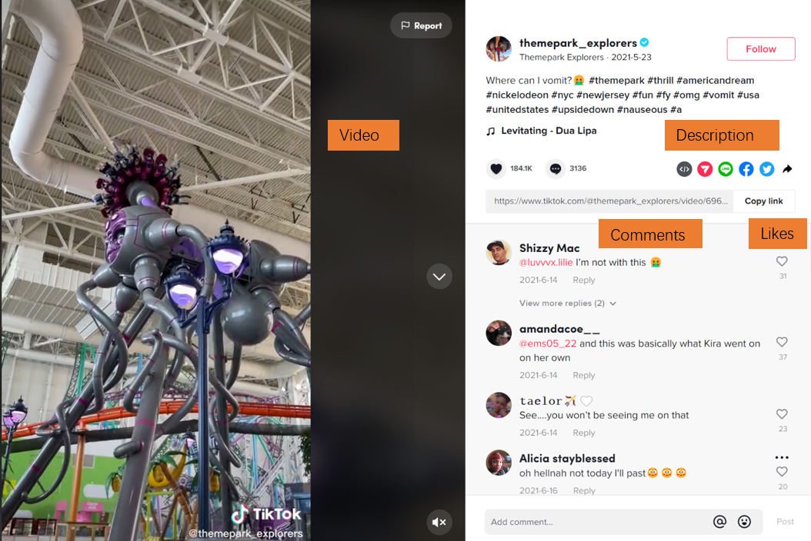

# MVIndEmo: A Dataset for Micro-video Public Induced Emotion Prediction on Social Media

This repository contains a description of our recent work on the dataset: public induced emotion prediction dataset for micro videos - MVIndEmo

## Overview of dataset

Induced emotion is evoked in the audiences for content and has widely range of applications especiallyin the field of social media. Induced emotion is different from perceived emotion, which conveyed by the content, it is spontaneous feelings after a deep understanding of the content. We proposed a novel research task of public induced emotion prediction of micro video. Meanwhile, we construct the dataset for public induced emotion prediction dataset of micro videos, named MVIndEmo.It is collected from Tiktok-a trending social media platform for creating and sharing micro video. We design an automated label generation strategy utilizing video comments for two tasks: induced emotion polarity and induced emotion classification. We provide both binary classification and probability distribution labels to accommodate flexible benchmark settings. 

### Dataset Description

We select eight social topics that gave rise to discussion on Tiktok to collect the raw data-including micro video information and corresponding user comments. These topic is from the news website such as CNN, New York Times and FOX news. Then, we determine the relevant hashtags.  with search the corresponding keyword in Tiktok website. The topics and the relevant hashtags is shown in Table.
| Topic | Hashtag |
|:------|:--------|
|Amarica| america, usa, nyc, americandream, immigrant, Mexican|
|Politics| geopolitics, ukraine, ukrainewar,ww3|
|Digital Currency| bitcoin, btc, cryptocurrency, eth, nft|
|Sports| football, soccer, nba, nfl|
|Olympics| olympics, athlete, tokyo2020, winterolympics, teamusa|
|Corona Virus| coronavirus, happyathome, lockdown|
|Economy| economy, gasprices,inflation,money,stocks|
|Abortion| abortion, feminism, prochoice, prolife, roevwade|
We totally collect 10777 videos and 2947647 comments from tiktok website to construct this dataset. The page of micro video on tiktok is shown as figure.

After the process of data clean and filter, the MVIndEmo dataset contains 7153 videos covering the eight hot topics, corresponding public induced polarity labels and emotion classification labels. We design a strategy to analyze the sentiment of comments, then generate the public induced emotion of micro videos by summarizing them. For the emotion polarity task, there are three label:positive, negative, and neutral. And the classificaton label inclue six categories: anger, fear, joy, love, sadness, and surprise. 

## License

The MVIndEmo data set is in the public domain. We released the MVIndEmo data set under a CC BY-SA 4.0 license. The data license form should be signed before accessing the data. Please sign the form data/Liscense Agreement.pdf and send it to hsslab.inspur@gmail.com and we will provide the link for data download.
